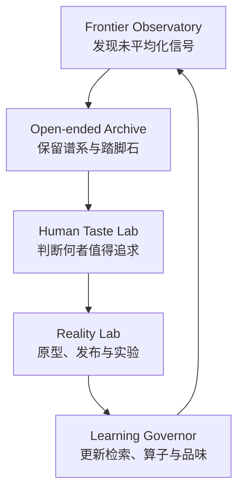

# FrontierOS v2：让 Agent 持续处于创意前沿

**研究快照：2026-08-15（Asia/Singapore）**  
**定位：** CreativeOS-99 的第二代架构；目标不是稳定地产出“像好作品的内容”，而是持续发现尚未被模型平均化的新信号，并将人的品味与真实世界结果转化为长期复利资产。

## 1. 结论

CreativeOS-99 v1 已经强于常规 Persona、单轮 RAG、Best-of-N 和普通多 Agent：它分离发散与收敛，引入专门创意知识库、结构化算子、多样性维持、盲审和人类偏好学习。但它仍可能成为一个高水平的**静态创意优化器**。

未来 AI 内容越多，静态知识库、长 Soul、通用 Creative Skill 和“写得更像人”的能力越容易被复制，也越容易被合成内容污染。真正的长期壁垒应升级为：

\[
Moat = HumanRaw \times OpenEndedLineage \times MultiDimTaste \times ExecutedOutcome \times TimeSplitEval
\]

- `HumanRaw`：未经 AI 平均化的人类观察、草图、访谈、失败与现场材料；
- `OpenEndedLineage`：不只保留冠军，而是保留可继续演化的谱系与踏脚石；
- `MultiDimTaste`：把个人、专业、社会和反共识判断分开建模；
- `ExecutedOutcome`：作品进入读者、市场、原型或实验后的结果；
- `TimeSplitEval`：只用未来窗口检验“当时的新颖”是否真的有生命力。

这五项中任何一项趋近于零，系统都可能退化为高质量模仿器。

## 2. 为什么现有配置还不够

| 风险 | 常规系统的行为 | FrontierOS v2 的修正 |
|---|---|---|
| 模型先验趋同 | 不同 Agent 复述相似高概率结构 | 异构模型、关系类比、反共识岛与未知档案 |
| 合成数据回流 | AI 摘要再喂给 AI，逐代丢失长尾 | 来源分层、保留原件、限制顺序转述 |
| 过早淘汰 | 只留当前总分最高的候选 | Pareto 档案、谱系、踏脚石转化率 |
| 单一 Reward | 流畅度或“像专家”吞掉惊奇和张力 | 七维向量、独立 Judge、保留分歧 |
| 品味过拟合 | 把用户过去的选择训练成审美牢笼 | TasteCore / Context / Frontier 三层模型 |
| 伪新颖 | 语义距离远但离题、不可执行 | 时间新颖、结构新颖与执行存活联合检验 |
| 漂亮但无记忆 | 文本更顺，却被读者迅速遗忘 | 延迟回忆、传播、行为或实验结果回写 |

## 3. 论文证据给出的新边界

以下数字来自论文，不是本项目承诺的效果量。预印本结论需要在目标创作域复现。

| 证据 | 关键观察 | 系统含义 | 边界 |
|---|---|---|---|
| Heuresis（2026） | 6 种搜索策略、3 个领域、3,222 次评分运行中，没有想法被评为“Original”；质量前十只有 1 个新颖想法；1,628 次评分运行发现 40 个确认的虚构 | 搜索算法能改变候选落点，但不能自动扩张质量—新颖前沿；必须补充真实新信号与验证 | 预印本；科学构想任务 |
| 跨域关系类比（2026） | 多样性提高 90%–173%；超过 50% 候选被判新颖，而部分基线低至 1.6%；4 个生物医学任务中实现原型并获得增益 | 知识库应检索深层关系，不只是文本相似近邻 | 预印本；领域集中在生物医学 |
| Model collapse（Nature, 2024） | 递归使用生成数据会造成分布尾部丢失和模型退化 | 原始人类数据、版本、AI 参与度和来源链必须长期保留 | 训练分布研究，不等同于所有 RAG 场景 |
| TASTE（2026） | 10 位专业设计师、4 个 T2I 模型、9 个标准；现成 Judge 与五人多数意见的 macro agreement 均未超过 0.55 | “品味”不可压成一个通用分数；维度与人群必须分开 | 预印本；视觉设计域 |
| Scientific Taste（2026） | 约 70 万组时间/领域匹配的高低引用论文对，可训练科学品味 Judge/Thinker | 品味可学习，但代理目标决定它学到什么 | 引用是群体影响代理，不是个人品味 |
| HindSight（2026） | 用未来 30 个月做时间切分；RAG 构想的未来影响分约为 vanilla 的 2.5 倍；LLM 新颖度判断与未来影响负相关，ρ=-0.29 | 评测不能让 Judge 看到未来；必须跟踪延迟真实结果 | 预印本；未来影响为论文内定义 |
| 人机共创激励（2026） | 预注册实验中，原创性激励提升集体多样性，使参与者更少逐字照抄 AI，并更选择性地使用 AI | 工作流、奖励和决策权比“是否使用 AI”更重要 | 预印本；实验任务边界明确 |
| Creo（2026） | 渐进式、低确定性表征和 decision locks 提升所有权并减少输出同质化 | 人应在结构尚未被润色时介入，并锁住关键选择 | 预印本；交互式创作工具 |
| Lost Before Translation（2026） | AI 到 AI 的重复转述趋向中等置信、弱情感和分析化结构，丢失引语、归因、保留意见和证据纹理 | Agent 应优先读取原件；摘要只能做索引，不能替代来源 | 预印本；重复传递设置 |
| VLM Picbreeder（2026） | 将开放式搜索表示为持续生长的树，人类选择有趣踏脚石而非单一终点 | 创意系统应保存谱系和“尚不知用途但值得继续”的节点 | 预印本；视觉开放式搜索 |
| AgentPanel（2026） | 1,508 条问题线程、467 个 Agent、29 万余事件；异构、去中心化候选池扩大了人类选择空间 | 多 Agent 的价值在异质候选供给，不在群聊达成一致 | 预印本；平台场景与选择偏差 |
| Budgeted Subset Refinement（2026） | 直接生成或重排在其代理指标下没有得到研究级强非重复想法；多样性感知的选择性精炼给出更好组合 | 预算应投向少量互补候选的深度验证，而非平均润色全部 | 预印本；指标与任务需外部复现 |

完整来源与状态见 [references.md](references.md)。

## 4. FrontierOS v2 闭环



### 4.1 Frontier Observatory：前沿观测站

输入不是“互联网最新内容”本身，而是尚未稳定进入主流模型先验的信号：

- 第一手访谈、用户抱怨、现场观察、草图、未完成作品和失败日志；
- 新论文的机制、限制、反常结果和作者未解决问题；
- 小众社群、跨语言语料、不同文化的隐喻和被忽视的实践；
- 时间窗口为 30/90/365 天的主题增速、近邻密度、概念饱和度与分歧度；
- 与现有档案结构相似度低、但功能关系可迁移的信号。

观测站不直接宣布“趋势”。它生成带来源、时间和不确定性的 `frontier_signal`，再交由档案和人筛选。

### 4.2 Open-ended Archive：开放式创意档案

档案不只保存当前高分候选，而是维护至少七个生态位：

1. 高质量 / 低风险；
2. 高新颖 / 中等可行；
3. 高个人品味匹配；
4. 高争议 / 高潜力；
5. 远距类比；
6. 反共识；
7. 暂时无法解释但有吸引力的异常。

每个候选保存父节点、知识节点、创意算子、模型与配置、人类选择理由、拒绝原因、执行结果和后代。搜索使用 islands + MAP-Elites 或其他质量—多样性方法；各岛独立演化，只进行低频迁移，避免全局单一冠军导致过早收敛。

### 4.3 Human Taste Lab：人类品味实验室

品味分三层，不能压入一个 Soul 或 Reward：

- `TasteCore`：长期价值、声音、伦理与不可妥协项；慢更新；
- `TasteContext`：项目、媒介、受众、阶段和商业约束；快更新；
- `TasteFrontier`：令人意外、尚不理解、暂不愿定论的方向；主动保留不确定性。

人类反馈至少有三种结果：`keep`、`reject`、`interesting_uncertain`。第三类不是“中分”，而是继续探索的资源。详见 [human-taste-protocol.md](human-taste-protocol.md)。

### 4.4 Reality Lab：真实执行实验室

创意必须离开文本评分器：

| 领域 | 至少一个真实结果 |
|---|---|
| 写作 | 即时偏好 + 1 周后情节/观点回忆 + 情绪轨迹 |
| 品牌 | 识别、差异化、分享意愿、搜索或访问变化 |
| 产品 | 可操作原型、任务完成、行为变化、留存 |
| 科学 | 可运行代码、实验、基线、消融、失败复现 |
| 视觉 | 注意、识别、专业评审、风格近邻风险 |
| 内容 | 完读、收藏、分享、1 周和 1 月后的延迟回忆 |

反馈建议在 1 周、1 个月、3 个月回写。否则系统只能优化“第一次看上去很厉害”。

### 4.5 Learning Governor：学习治理器

治理器不直接重写整个 Soul。它根据证据更新不同资产：

- 稳定、跨项目复现的选择 → `TasteCore` 候选，需人确认；
- 项目局部偏好 → `TasteContext`；
- 高分歧、高潜力路线 → `TasteFrontier`；
- 多次执行有效的机制 → 提高知识节点/算子价值；
- 失败但产生高价值后代的节点 → 保留为踏脚石；
- 来源未知或高度合成的材料 → 降权或隔离，不更新世界模型。

## 5. 专门创意知识库 v2

### 5.1 来源纯度分层

| 等级 | 定义 | 默认用途 | 禁止事项 |
|---|---|---|---|
| H0 | 人类原生一手材料：访谈、草图、实验、现场笔记、原作 | 更新机制、品味、世界模型；高权重 | 不得只保存摘要后删除原件 |
| H1 | 人类审阅或同行评审材料 | 证据、约束、方法和校验 | 不得把共识误当永恒真理 |
| M0 | 可追溯、经人确认的 AI 辅助材料 | 候选、索引、重组素材 | 不单独更新高权重核心 |
| M1 | 来源不明或高度合成材料 | 隔离区、污染检测、反模式研究 | 不进入核心训练或作为事实证据 |

机器可读定义见 [`provenance-tier.schema.json`](../schemas/provenance-tier.schema.json)。

### 5.2 原件优先与防摘要漂移

- Agent 可用摘要定位，但关键判断必须回到原文、原始数据、录音、草图或实验记录；
- 保留引语、归因、保留意见、证据等级、失败路径和作者措辞；
- 限制 AI→AI 顺序重写层数；摘要必须记录父来源和变换链；
- 结论应能沿 `evidence_refs` 回溯到 H0/H1 节点；
- 建立“过度润色”检测：置信度过度居中、异常同构的段落结构、情感与异议消失。

### 5.3 关系类比节点

文本相似检索通常返回表面近邻，最容易制造固定。前沿库应把“功能—机制—适用条件—失败条件”作为一等对象：

```yaml
source_domain: 生态系统
target_function: 资源动态分配
mechanism: 局部反馈形成全局平衡
surface_similarity: low
structural_similarity: high
transfer_conditions:
  - 多主体
  - 资源有限
  - 局部可观测
failure_conditions:
  - 需要中心化强一致性
evidence:
  - 原始论文
  - 实验结果
```

检索先按 `target_function` 和机制关系寻找遥远领域，再用迁移/失败条件做约束验证。不要先按标题或词向量的近似度排序。

### 5.4 创意谱系

一个候选不是一段文本，而是一个可继续演化的节点：

- `parents`：直接父候选；
- `lineage_id / niche`：所属谱系和生态位；
- `knowledge_nodes / operators`：本次改变来自何处；
- `generation_config`：模型、版本、采样与上下文摘要；
- `human_rationale`：为何保留、拒绝或暂缓判断；
- `execution_outcomes`：现实结果与观测窗口；
- `descendants`：后续影响；
- `scores`：七维向量及 Judge 分歧，而非单一总分。

机器可读定义见 [`creative-candidate.schema.json`](../schemas/creative-candidate.schema.json)。

## 6. 搜索与选择：保持多条不收敛路线

每轮应先分配探索预算，再生成候选。以下比例是**工程启发式，不是自然定律**：

- 50%：经验证机制和可靠知识；
- 30%：相邻前沿、新论文、小众案例和跨域关系；
- 20%：高风险、异常、反共识和用途未知的踏脚石；
- 另让 10%–20% 候选绕过个人品味预筛，防止系统只会讨好过去的你。

人类注意力优先给“高质量 + 高 Judge 分歧”“高潜力 + 高不确定”项目，不要浪费在明显失败或所有 Judge 都同意的候选上。预算受限时，对少量互补子集做深度精炼和执行验证，而不是平均润色整个池。

## 7. 七维目标与 Pareto 档案

不再把所有指标加成一个 Reward。每个候选记录：

\[
F(x)=[Q,N_t,N_s,D,T,E,P]
\]

| 维度 | 定义 |
|---|---|
| Q | 成品质量、连贯、技艺和约束满足 |
| N_t | 相对 30/90/365 天知识窗口的时间新颖度 |
| N_s | 与现有模式相比的结构/机制新颖度 |
| D | 对当前档案覆盖面的新增贡献 |
| T | 品味匹配与“有意义的惊奇”；保留各品味层分数 |
| E | 经过原型、受众、市场或实验后的存活度 |
| P | 来源、证据、可追溯性与事实可靠度 |

硬约束不满足的候选先淘汰；其余保留 Pareto 非支配集合。总分只能用于局部展示，不能删除在某一轴独特的路线。

### 核心长期指标

| 指标 | 建议定义 |
|---|---|
| 前沿扩张率 | 本周期新增且在下一周期仍为 Pareto 非支配的结构簇 / 总投入 |
| 创意半衰期 | 某候选从高新颖降至中位新颖所需时间 |
| 踏脚石转化率 | 被标记 `interesting_uncertain` 后产生高价值后代的比例 |
| 跨域迁移增益 | 使用关系类比后，相对同预算近邻检索的盲评/执行提升 |
| 执行存活率 | 进入现实测试后仍跨过质量与价值门槛的比例 |
| 品味预测校准 | 预测置信度与实际选择的一致性；用 Brier/ECE 分层报告 |
| 每分钟人类杠杆 | 人类审阅每分钟带来的 Pareto 前沿增量或胜率提升 |
| 来源纯度 | H0/H1 对最终候选的可追溯贡献占比 |
| 模型支配度 | 最大单一模型家族对保留候选的贡献份额 |
| 未知保留率 | `interesting_uncertain` 节点在约定窗口内未被过早删除的比例 |

同时报告最近邻风险、Judge 分歧、未知来源率和模型/语言/模态贡献，防止指标表面增长。

## 8. 人类何时介入

人类不是最终审批按钮，而负责 AI 最难替代的五件事：

1. 选择真正值得解决的问题；
2. 给出不可妥协约束、生活经验和一手观察；
3. 指出哪些异常“说不清，但值得留下”；
4. 识别与现实、伦理、文化和身体经验的冲突；
5. 在低保真阶段做 decision locks，保护作者所有权和路线差异。

交互顺序应是：先看结构、关系、草图和矛盾，再看 polished draft。一次展示十个看似完整的成品，会把人的角色降为挑选者，也会放大 AI 的默认审美。

## 9. 什么才算领先

“领先”不是某次赢过通用模型，而是同时满足：

- 在时间切分隐藏题上持续扩张 Pareto 前沿；
- 新模型替换后，知识、谱系、品味与执行资产仍然有效；
- 真实世界存活率提高，而非只提高 LLM Judge 分数；
- 模型支配度下降，档案仍保持多条来源、语言和机制路线；
- 人类花更少时间却做出更高信息量的选择；
- 能说明每个重大创意来自何种信号、算子、人类判断和现实反馈。

下一阶段的壁垒不是“让 AI 像一个更厉害的创作者”，而是建立一个人类与 AI 共同维护、持续发现并保护未知可能性的创意生态系统。

## 10. 实施入口

- [90 天实施路线](90-day-roadmap.md)
- [人类品味协议](human-taste-protocol.md)
- [v2 一手论文证据](references.md)
- [来源分层 Schema](../schemas/provenance-tier.schema.json)
- [品味事件 Schema](../schemas/taste-event.schema.json)
- [候选谱系 Schema](../schemas/creative-candidate.schema.json)
